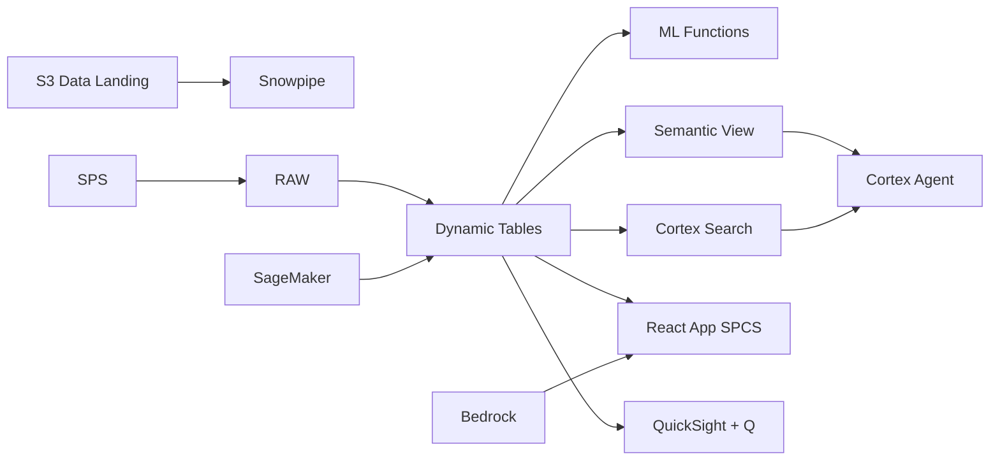

# Quality Analytics & Defect Prediction

Quality Analytics & Defect Prediction for Vietnam - ML.FORECAST and Dynamic Tables power real-time quality analytics intelligence for electronics manufacturing in Ho Chi Minh City & Bac Ninh.

## Architecture

Vietnam electronics manufacturing faces increasing complexity in quality analytics. Decision-makers in Ho Chi Minh City & Bac Ninh need real-time intelligence and ML-powered recommendations.



## Snowflake Capabilities

| Capability | Implementation |
|-----------|---------------|
| Dynamic Tables | PERFORMANCE_DASHBOARD / TREND_ANALYTICS / FORECAST_INPUT / OPERATIONAL_RISK |
| ML Functions | ML.FORECAST + ML.ANOMALY_DETECTION |
| Cortex AI | COMPLETE, SUMMARIZE, AI_CLASSIFY |
| Cortex Search | 100 documents indexed |
| Cortex Agent | ELECTRONICS_QUALITY_AGENT |
| Semantic View | ELECTRONICS_QUALITY_ANALYTICS |
| React App (SPCS) | 5 tabs + DemoGuide |


## AWS Services

| Service | Role in Demo |
|---------|-------------|
| AWS IoT Core | Ingest real-time data from electronics manufacturing systems |
| Amazon SageMaker | Quality Analytics ML models |
| AWS Glue | ETL and data transformation |
| Apache Iceberg (S3) | Open table format for data sharing |
| Amazon Bedrock (Claude) | Generate quality analytics recommendations |
| Amazon QuickSight + Q | Quality Analytics dashboard with NL queries |


## Personas

| Persona | Role | Key Questions |
|---------|------|---------------|
| **Dr. Pham Duc Thanh** | VP Quality | "What are the key quality analytics metrics?" "Which areas need attention?" |
| **Le Thi Huong** | Quality Engineer | "Show me the trend analysis." "Which operations are underperforming?" |


## Data

| Table | Rows | Description |
|-------|------|-------------|
| OPERATIONS | 100,000 | Core operational records for quality analytics |
| METRICS | 500,000 | Time-series performance metrics |
| ASSETS | 5,000 | Asset and entity master data |
| EVENTS | 200,000 | Operational events and incidents |
| DOCUMENTS | 100 | SOPs, reports, and compliance docs |


## Build Instructions

### Prerequisites
- Snowflake account with ACCOUNTADMIN access
- Cortex AI enabled (ML Functions, Search, Agent)
- Warehouse: ELECTRONICS_WH (Medium)
- AWS CLI with access (us-west-2)

### Deployment

```bash
snowsql -f snowflake/00_setup.sql
snowsql -f snowflake/01_marketplace_install.sql
snowsql -f snowflake/02_raw_tables.sql
snowsql -f snowflake/03_staging.sql
snowsql -f snowflake/04_dynamic_tables.sql
snowsql -f snowflake/05_search.sql
snowsql -f snowflake/06_ml_models.sql
snowsql -f snowflake/07_semantic_view.sql
snowsql -f snowflake/08_agent.sql
```

### React App (SPCS)
```bash
cd app && npm ci && npm run build
docker build -t aws-vietnam-electronics-quality-app .
docker push bdiqc8sm-default.registry.snowflakecomputing.com/electronics_quality/app/aws_vietnam_electronics_quality/app:latest
```

### Demo Mode
Open the app URL with `?demo=true` for presenter view.

## Build Modes

### Snowflake Only
Run scripts 00-08 (skip AWS-specific integration). Uses:
- **Snowpipe Streaming SDK** instead of AWS IoT Core
- **ML.FORECAST + ML.ANOMALY_DETECTION** instead of Amazon SageMaker
- **Dynamic Tables** instead of AWS Glue
- **Snowflake-managed Iceberg Tables** instead of Apache Iceberg (S3)
- **Cortex Complete** instead of Amazon Bedrock (Claude)
- **Snowflake Intelligence (Cortex Analyst)** instead of Amazon QuickSight + Q

### Full AWS + Snowflake
Run all scripts including AWS integration. Deploy QuickSight dashboard from `quicksight/`.

## Business Impact

Industry research and Snowflake customer outcomes:
- **Vietnam's electronics exports reached $114B in 2024 — Samsung alone accounts for $65B (20% of Vietnam's total exports)** — [General Statistics Office Vietnam](https://www.gso.gov.vn/en/data-and-statistics/2024/01/socio-economic-situation-report/)
- **Defect rates in semiconductor packaging must stay below 1 DPPM — AI visual inspection achieves 99.9% accuracy** — [SEMI](https://www.semi.org/en/industry-resources/market-data)
- **Samsung invested $22B in Vietnam manufacturing, operating 6 factories with 100,000+ employees** — [Samsung Vietnam](https://www.samsung.com/vn/aboutsamsung/company/vietnam/)
- **KLA Corporation reduced wafer inspection time 40% using ML-based defect classification on cloud platforms** — [McKinsey Semiconductors](https://www.mckinsey.com/industries/semiconductors/our-insights/ai-in-semiconductor-manufacturing)

## Key Demo Numbers

- **100K operations** tracked in Ho Chi Minh City & Bac Ninh
- **500K metrics** time-series data points
- **5K assets** monitored
- **100 docs** searchable


## License

Apache 2.0 — See [LICENSE](LICENSE) for details.

This is a personal demo project and is not an official Snowflake offering. It comes with no support or warranty.